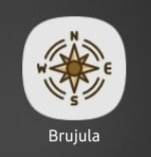
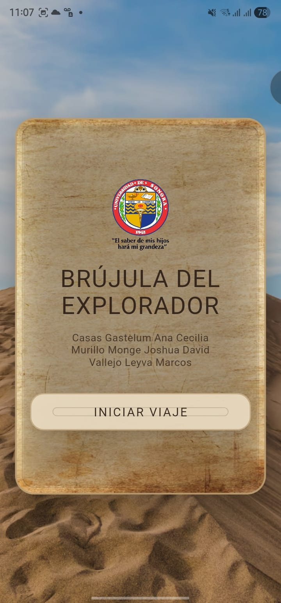
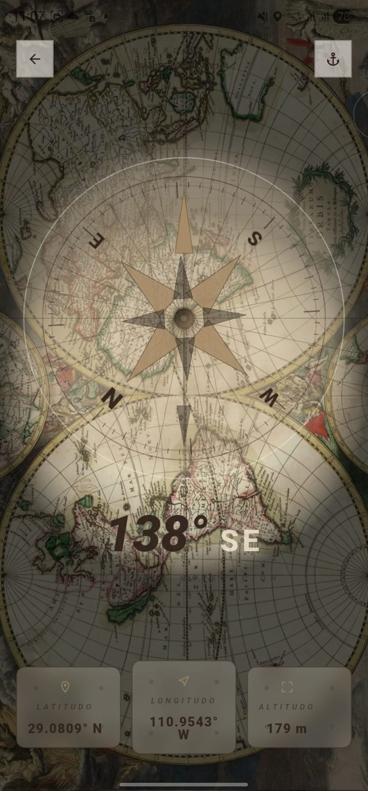
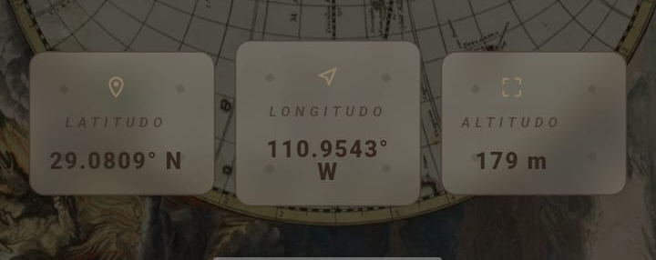

<div align="center">

# 🧭 Brújula del Explorador

Aplicación móvil desarrollada en **Flutter** que implementa sensores reales del dispositivo para mostrar la orientación (brújula digital) y la ubicación en tiempo real, integrando un diseño inspirado en mapas cartográficos antiguos.

<br>



<br><br>

<!-- Badges -->


</div>

---

## 👨‍💻 Autores

- Marcos Vallejo  
- Cecilia Casas  
- Joshua Murillo  

---

## 📌 Descripción

**Brújula del Explorador** es una aplicación móvil funcional que:

- Detecta la orientación del dispositivo utilizando el magnetómetro.
- Muestra los grados en tiempo real.
- Indica puntos cardinales.
- Obtiene coordenadas GPS en tiempo real.
- Presenta un diseño temático tipo cartografía antigua.
- Implementa animaciones suaves y filtros de estabilización de datos.

Proyecto desarrollado como parte de la **Tarea 05 – Brújula**.

---

## 🛠 Tecnologías Utilizadas

### 📱 Desarrollo
- Flutter SDK (3.x)
- Dart (3.x)
- Arquitectura modular por capas

### 📡 Sensores y Funcionalidad
- flutter_compass (magnetómetro / orientación)
- geolocator (ubicación en tiempo real)
- permission_handler (gestión de permisos)
- AnimationController (animaciones)
- Filtro de suavizado personalizado (smoothing)

### 🎨 Diseño
- Material Design
- Google Fonts (Great Vibes, Allura, Uncial Antiqua)
- Assets personalizados (texturas tipo pergamino y mapas antiguos)
- Componentes reutilizables

### 🔧 Control de Versiones
- Git
- GitHub

---

## 📂 Estructura del Proyecto (lib/)

```bash
lib/
├── main.dart
├── app.dart
│
├── theme/
│   ├── app_colors.dart
│   └── app_theme.dart
│
├── screens/
│   ├── start_screen.dart
│   └── compass_screen.dart
│
├── widgets/
│   ├── animated_background.dart
│   ├── compass_dial.dart
│   ├── info_cards.dart
│   └── unison_header.dart
│
├── services/
│   ├── compass_service.dart
│   ├── location_service.dart
│   └── permission_service.dart
│
├── controllers/
│   └── compass_controller.dart
│
├── models/
│   └── compass_state.dart
│
└── utils/
    ├── smoothing.dart
    └── formatters.dart


📸 Imágenes de la Aplicación
<div align="center"> <table> <tr> <td align="center"> <b>Vista de Inicio</b><br><br>  </td> <td align="center"> <b>Vista Brújula</b><br><br>  </td> </tr> <tr> <td align="center"> <b>Ubicación en Tiempo Real</b><br><br>  </td> <td align="center"> <b>Icono de la App</b><br><br>  </td> </tr> </table> </div>
📦 Release 1.0

La versión estable se encuentra en:

Releases → v1.0

Incluye:

APK instalable para Android

Compilación en modo release

Generar APK
flutter build apk --release

Ubicación del archivo generado:

build/app/outputs/flutter-apk/app-release.apk
🚀 Cómo Ejecutar el Proyecto
flutter pub get
flutter run
